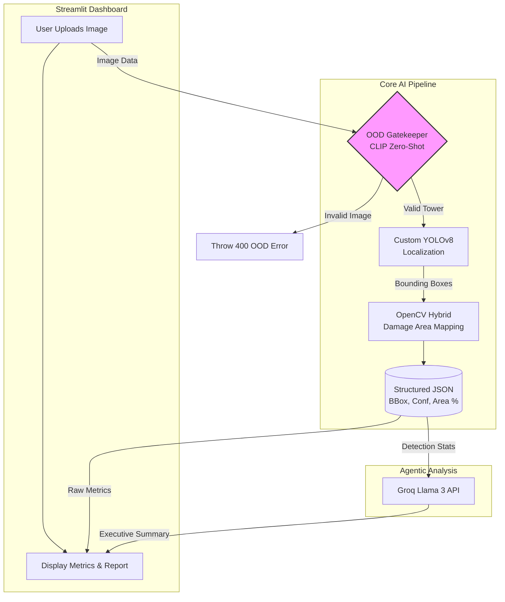
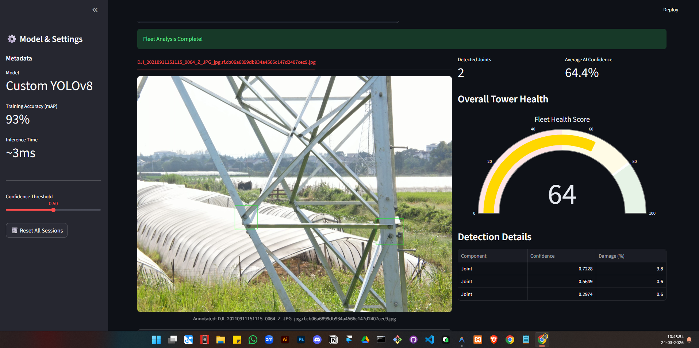
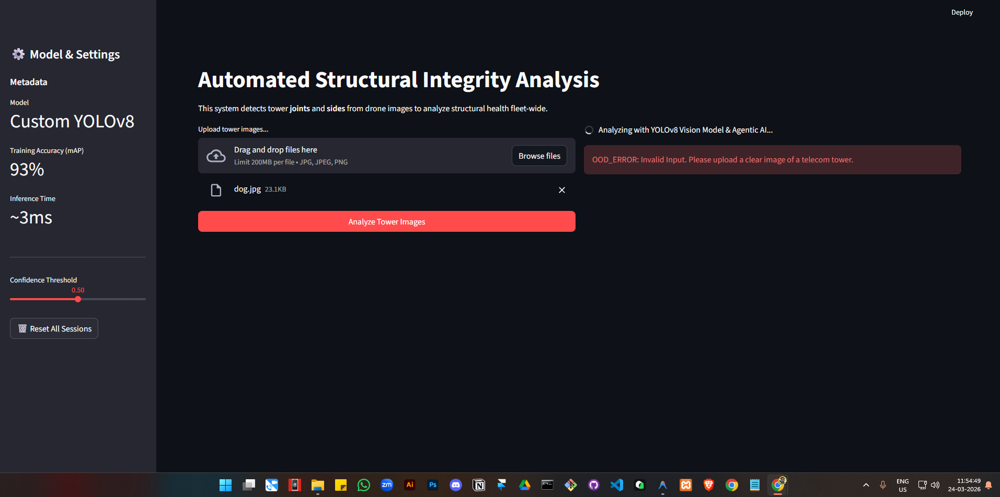

# 🗼 Multimodal Tower Inspection & Agentic Reporting System

**Automating structural health monitoring with deep learning and AI agents.** Manual telecom tower inspections are slow, dangerous, and lack precise damage quantification. This project solves that by creating an end-to-end pipeline that verifies drone imagery, detects structural anomalies, calculates exact damage area percentages, and automatically generates executive PDF reports.

Built with **Custom Vision Models (YOLOv8)**, **Hybrid Area Mapping (OpenCV)**, and **LLM Agents (Groq Llama 3.1)**.

## 🛠️ Tech Stack & Tools


-0466C8?style=for-the-badge&logo=meta&logoColor=white)

## 🧠 System Architecture Workflow


**1. Main Dashboard & Damage Area Mapping:**


**2. OOD Gatekeeper Blocking Invalid Images:**


## 🚀 Key Features
- **OOD Gatekeeper (Zero-Shot Classification):** Integrates Hugging Face's CLIP model to validate input images, preventing "Garbage In, Garbage Out" by rejecting non-tower images before heavy processing.
- **Object Detection:** Custom YOLOv8 model trained to localize structural joints and anomalies.
- **Hybrid Damage Quantification:** Uses OpenCV within the detection pipeline to calculate the precise pixel percentage of corrosion/damage inside the bounding boxes, moving beyond simple object detection.
- **Agentic Analysis:** Feeds structured detection data into a Groq LLM (Llama 3.1) to generate human-readable, fleet-wide executive reports.
- **Production-Ready UI:** A robust Streamlit dashboard featuring side-by-side metric layouts, dynamic gauge charts, and session-state persistence.
- **Automated Reporting:** Generates downloadable PDF summaries of structural health.

## 📂 Dataset & Model Weights
To maintain a lightweight repository, heavy model weights (`.pt`) and image datasets are excluded via `.gitignore`. 
- **Dataset:** The model was trained using the [Roboflow Cell Towers Dataset](https://universe.roboflow.com/roboflow-100/cell-towers). 
- **To run locally:** Download the dataset, place it in a `datasets/` folder in the root directory, and train the model using the provided `train_model.py` script. Alternatively, place your pre-trained custom YOLOv8 `.pt` file in the root directory.

## ⚙️ Setup & Installation

1. **Clone this repository:**
   ```bash
   git clone [https://github.com/souravppm/Tower-Inspection-AI-Agent.git](https://github.com/souravppm/Tower-Inspection-AI-Agent.git)
   cd Tower-Inspection-AI-Agent
   ```

2. **Create a virtual environment and activate it:**
   ```bash
   # On Windows:
   python -m venv venv
   venv\Scripts\activate

   # On macOS/Linux:
   python3 -m venv venv
   source venv/bin/activate
   ```

3. **Install dependencies:**
   ```bash
   pip install -r requirements.txt
   ```

4. **Environment Variables:** Create a `.env` file in the root directory and add your Groq API key:
   ```env
   GROQ_API_KEY=your_api_key_here
   ```

5. **Run the application:**
   ```bash
   python -m streamlit run frontend/app.py
   ```
